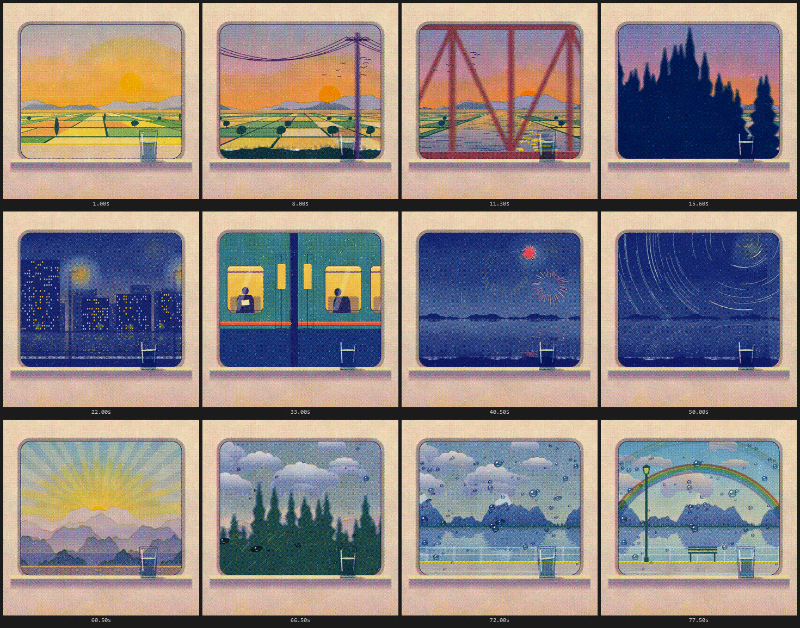

# Window Seat

A 78-second risograph film of a night train journey, seen through one fixed window with a glass
of water on the sill. Every pixel and every sound except the piano is procedural, and the whole
film is a single `index.html` of Canvas 2D and Web Audio: no libraries, fonts, images or network
calls.


**Watch:** download `window-seat.mp4` (1080 × 1080, 30 fps, 78 s, stereo) from the
[v1.0 release](https://github.com/sevenevesai/riso-windowseat/releases/tag/v1.0), or open
[`films/window-seat/index.html`](films/window-seat/index.html) in a browser and press play.

| Time | Passage |
|---|---|
| 0–19 s | Golden departure from a platform, fields, a red truss bridge, a conifer cutting, a tunnel |
| 19–38 s | A night city with a canal and a level crossing; another train overtakes, passengers in its windows |
| 38–57 s | Fireworks over a lake, sleeper hours with star trails, pre-dawn fog |
| 57–78 s | Dawn from a viaduct, rain streaming back along the glass, a lakeside halt under a rainbow |

The score, "A Light Left in the Window", is an original piano piece in 6/8 whose phrasing follows
the picture's own timeline. The glass of water leans with every acceleration and is the last
thing to settle.

## How it was made

I directed it; Claude Code (Anthropic's coding agent) wrote the code, working inside this repo
with the skills, rules and craft docs you see here. Each passage was designed in
[`FILM.md`](films/window-seat/FILM.md), proved on its hardest frame first, then inspected as
frame strips, 1:1 crops and loudness sheets rendered by the harness in `tools/`. Every frame is a
pure function of time (`seek(t)`), so any moment can be inspected exactly and the MP4 cannot drop
frames. `FILM.md` records the design decisions, measurements and remaining weaknesses honestly.



## Make your own with Claude

The repo is set up so a Claude Code session can pick it up and work at the same standard.

```
git clone https://github.com/sevenevesai/riso-windowseat
cd riso-windowseat/tools
npm install && npm run setup && npm test
```

Then open Claude Code in the repo root and ask, for example:

- "Make a 40 second riso film of a lighthouse keeper's night."
- "Make a riso poster of a heron on a pier at dusk."
- "Score this film" or "The rain at 66 s is too loud."
- "Extend Window Seat with a snowy mountain pass after the lake."

`CLAUDE.md` gives the session the contract and commands. The `riso-film`, `riso-still` and
`riso-score` skills in `.claude/skills/` carry the workflow and gates, and each skill's
`examples.md` points at the exact routines in the shipped films worth reusing. A hook warns when
an edit breaks determinism.

## What's inside

| Path | Contents |
|---|---|
| `films/window-seat/` | The film, its design record, sample credits and the piano-bank rebuild script |
| `films/roost/` | A 70 s one-take starling murmuration at dusk, scored for recorded strings |
| `films/lumen/`, `films/emergence/` | Two 28 s scored films in a call-and-response form, as further examples |
| `prints/workings/` | A still print series; the print kit that new works start from |
| `docs/` | The craft: brief, visual development, drawing, scene space, motion, sound, quality bar |
| `studies/` | Interactive A/B studies of each technique, and the sound kit |
| `tools/` | Scaffolding, verification, contact sheets, audio analysis and MP4 export ([README](tools/README.md)) |
| `.claude/` | Skills, the ink-plate rule and the determinism hook |

## License

MIT, see [LICENSE](LICENSE). The piano recordings embedded in Window Seat are Salamander Grand
Piano V3 by Alexander Holm under CC BY 3.0; see
[`AUDIO-SOURCES.md`](films/window-seat/AUDIO-SOURCES.md). The string recordings embedded in
Roost are VSCO 2 Community Edition by Versilian Studios under CC0 1.0; see
[`AUDIO-SOURCES.md`](films/roost/AUDIO-SOURCES.md).
